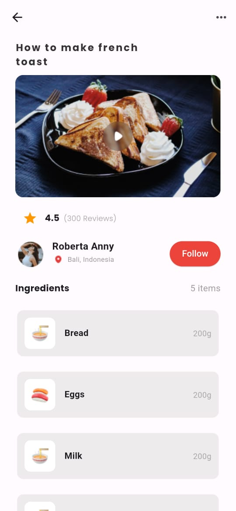

# Food Recipe App

This project is an assessment of my understanding on how to design UI in Flutter.

### Output:

### Challenges encountered:
- I initially had difficulty referencing images and fonts in my code
- I had difficulty in using the stack widget; where a smaller image is place on top a larger image
- I had difficulty utilizing the listview widget that contains the pictures of the food, its name and its weight.

### How I solved above challenges
- I employed a youtube video from the account [Smartherd](https://youtube.com/playlist?list=PLlxmoA0rQ-Lw6tAs2fGFuXGP13-dWdKsB&si=YzFifDDt4AAxP5Hw) to understand how to reference images and fonts
- I did research online and found a way to implement the desired layout
- I sat down with a colleague who taught me how to use the listview widgets.

### What I learnt
- Understood the difference between Row, Column and Expanded widgets
- Understood how to nest rows in columns, and columns in rows to create more interesting layouts
- Understood how to use popular widgets and how to create my own custom widget
- Understood how to use custom images
- Understood how to use custom fonts
- Understood the difference between Stateless and Stateful Widgets

